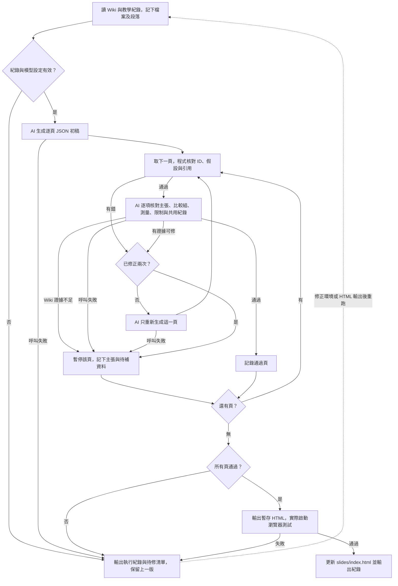

# 簡報生成與檢查流程

```mermaid
flowchart TD
    A["讀 Wiki 與教學紀錄，記下檔案及段落"] --> B{"紀錄與模型設定有效？"}
    B -- 否 --> Z["輸出執行紀錄與待修清單，保留上一版"]
    B -- 是 --> C["AI 生成逐頁 JSON 初稿"]
    C -- 呼叫失敗 --> Z
    C --> D["取下一頁，程式核對 ID、假設與引用"]
    D -- 通過 --> E["AI 逐項核對主張、比較組、測量、限制與共用紀錄"]
    E -- 通過 --> P["記錄通過頁"]
    E -- Wiki 證據不足 --> H["暫停該頁，記下主張與待補資料"]
    D -- 有錯 --> R{"已修正兩次？"}
    E -- 有證據可修 --> R
    E -- 呼叫失敗 --> H
    R -- 否 --> F["AI 只重新生成這一頁"]
    F -- 呼叫失敗 --> H
    F --> D
    R -- 是 --> H
    H --> N{"還有頁？"}
    P --> N
    N -- 有 --> D
    N -- 無 --> G{"所有頁通過？"}
    G -- 否 --> Z
    G -- 是 --> T["輸出暫存 HTML，實際啟動瀏覽器測試"]
    T -- 通過 --> I["更新 slides/index.html 並輸出紀錄"]
    T -- 失敗 --> Z
    Z -. 修正環境或 HTML 輸出後重跑 .-> A
```

正式流程以預設命令執行。對話重現模式讀取 Codex 已寫好的逐頁 JSON 與審查紀錄，測試模式注入錯誤引文。
